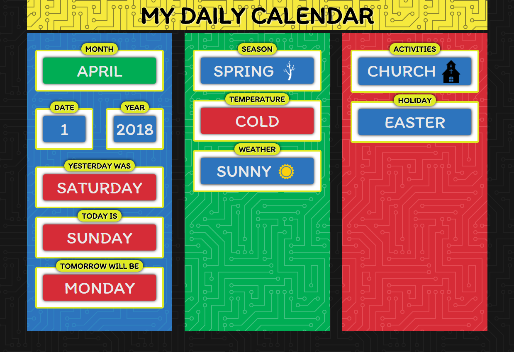
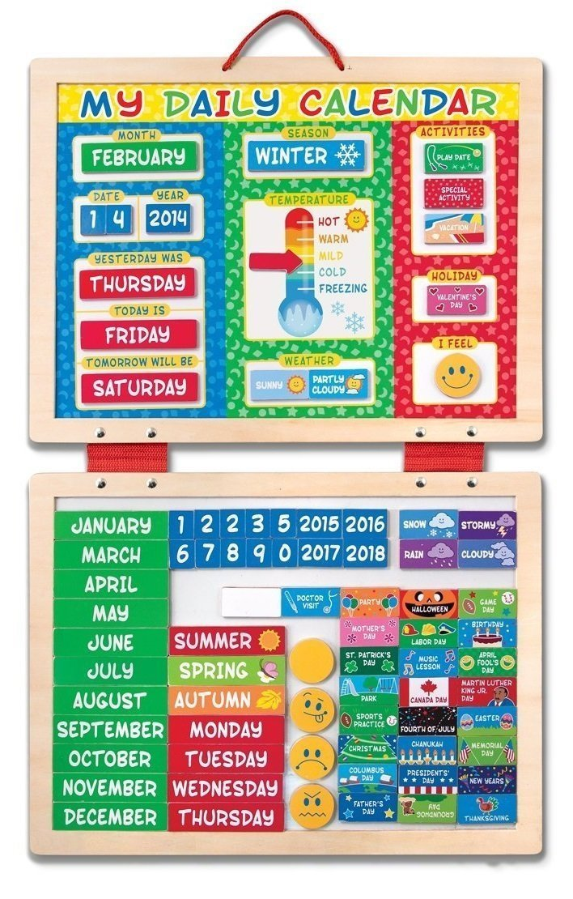

# ToddlerCalendar
Visual daily calendar for my son. The idea is based on the [Melissa and Doug Daily Calendar](https://www.amazon.com/Melissa-Doug-First-Magnetic-Calendar/dp/1223081273/ref=sr_1_2?ie=UTF8&qid=1516368489&sr=8-2&keywords=melissa+and+doug+daily+calendar). I wanted to create a digital version of the magnetic board that I could display on a monitor that he could see when he wakes up. 

## Inspiration

